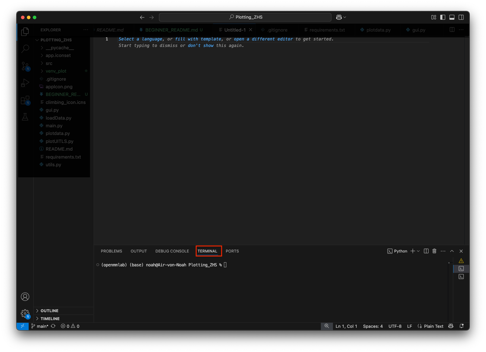
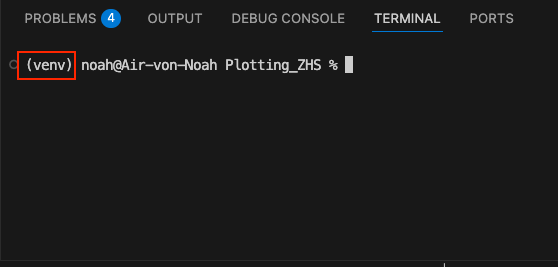

# Anleitung für absolute Beginner: So bringst du das Projekt zum Laufen

Diese Anleitung zeigt dir Schritt für Schritt, wie du das Projekt auf deinem Computer einrichtest, auch wenn du keine Erfahrung mit Programmen oder der Kommandozeile hast.

## 1. **VS Code installieren**

[Visual Studio Code (VS Code)](https://code.visualstudio.com/) ist eine kostenlose Software, die dir beim Schreiben und Ausführen von Code hilft. Hier ist der einfache Installationsprozess:

1. Lade VS Code von [hier](https://code.visualstudio.com/) herunter.
2. Folge den Anweisungen für dein Betriebssystem (Windows/Mac).
3. Öffne VS Code nach der Installation.

## 2. **Git installieren**

Git ist ein Tool, mit dem du Code von GitHub herunterladen und speichern kannst. Folge diesen Schritten:

- **Für Windows**: [Git für Windows herunterladen](https://git-scm.com/download/win) und installieren. (Meistens 64-bit Standalone)
- **Für macOS**: [Git für macOS herunterladen](https://git-scm.com/download/mac) oder installiere Git mit Homebrew:
  ```bash
  brew install git
  ```

Nach der Installation kannst du Git durch Eingabe von `git --version` im Terminal überprüfen, um sicherzustellen, dass es funktioniert. Falls du Terminal noch nicht so wie unten siehst: 
Öffnen über: Menü **Terminal > Neues Terminal**.




## 3. **Projekt von GitHub herunterladen (Klonen)**

Nachdem Git installiert ist, musst du das Projekt von GitHub herunterladen. Folge diesen Schritten:

1. Öffne das **Terminal** in VS Code. (FYI: Wenn irgendwo Bash steht, kannst du den darauf folgendend code immer im Terminal eingeben, Terminal ist der Ort, Bash eine Sprache)
2. Gib den folgenden Befehl ein und drücke **Enter**:

    ```bash
    git clone https://github.com/NoahFranz/Plotting_ZHS.git
    ```

3. Jetzt hast du das Projekt lokal auf deinem Computer. Navigiere im Terminal zu diesem Ordner:

    ```bash
    cd Plotting_ZHS
    ```

## 4. **Virtuelle Umgebung einrichten (empfohlen)**

Eine virtuelle Umgebung hilft dir, das Projekt ohne Konflikte mit anderen Programmen oder Versionen zu nutzen.

1. Gib diesen Befehl im Terminal ein, um eine virtuelle Umgebung zu erstellen:
   
   
   **Für macOS / Linux**:
   ```bash
   python3 -m venv venv
   source venv/bin/activate
   ```

   **Für Windows**:
   ```bash
   python -m venv venv
   venv\Scripts\activate
   ```

   Du solltest nun sehen, dass die virtuelle Umgebung aktiv ist (dies wird durch `(venv)` am Anfang deiner Terminalzeile angezeigt).
   

## 5. **Abhängigkeiten installieren**

Alle nötigen Pakete für das Projekt werden in einer Datei namens `requirements.txt` aufgelistet. Um diese zu installieren, führe den folgenden Befehl im Terminal aus:

```bash
pip install -r requirements.txt
```


## 6. **Programm ausführen**

Lade dir diese beispiel daten herunter:
https://github.com/NoahFranz/Plotting_ZHS/tree/main/sample_data

Füge Sie in einen Ordner ein, den du dann später wenn das Fenster erscheint, auswählst.

Jetzt bist du bereit, das Programm auszuführen! Gib einfach diesen Befehl ein:
Lese am besten noch die andere README.md datei. https://github.com/NoahFranz/Plotting_ZHS/blob/main/README.md

```bash
python main.py
```

Das Programm startet und eine grafische Benutzeroberfläche (GUI) wird angezeigt.

## 7. **Fertig!**

Nun kannst du die GUI verwenden, um Plots zu erstellen und das Projekt zu nutzen.

---

## Was ist ein Terminal und Bash?

- **Terminal** ist ein Programm, das es dir ermöglicht, mit deinem Computer über Textbefehle zu interagieren.
- **Bash** ist eine Programmiersprache, die du im Terminal benutzt, um Befehle einzugeben.
- **Git** ist ein Werkzeug, mit dem du Code aus dem Internet (z. B. GitHub) herunterladen und speichern kannst.

---

Viel Erfolg beim Ausführen des Programms! Wenn du Fragen hast, kannst du dich jederzeit melden.
